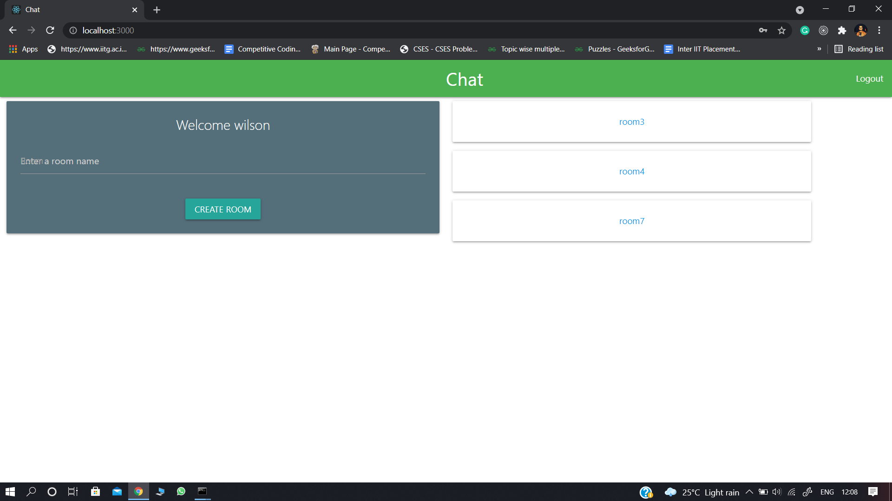
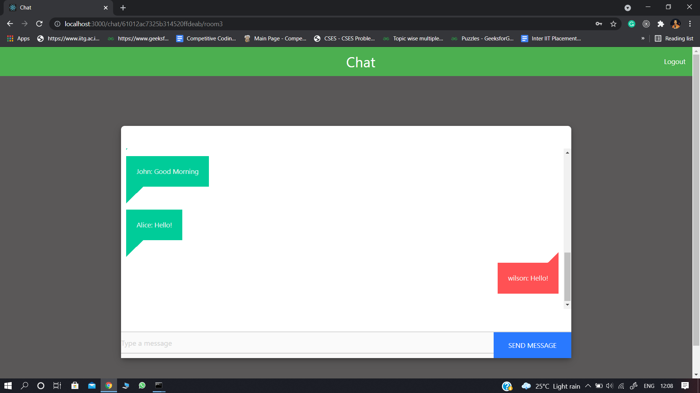
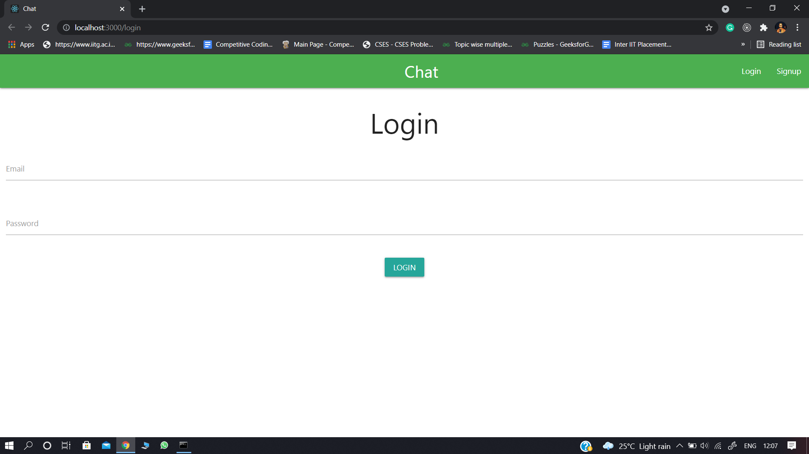
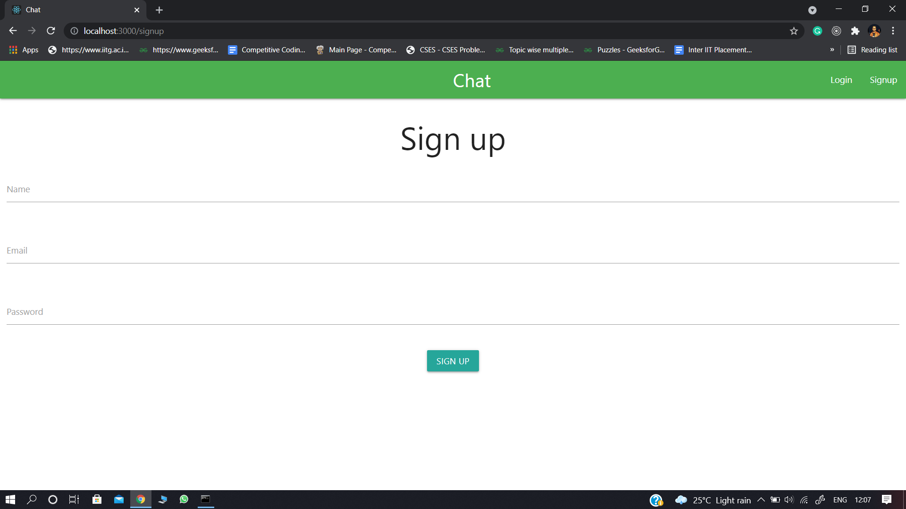

## Chat Application

Realtime Chat Application built using React, NodeJS, Socket.IO, and MongoDB.

### Technology Stack:-
* React (Frontend)
* NodeJS (Backend)
* MongoDB (Database)
* Socket.IO (for realtime event-based communication)
* Materialize CSS (for styling)

### Screenshots:-
* #### Home Page

 

* #### Chatroom Page

 

* #### Login Page

 

* #### Signup Page

 
